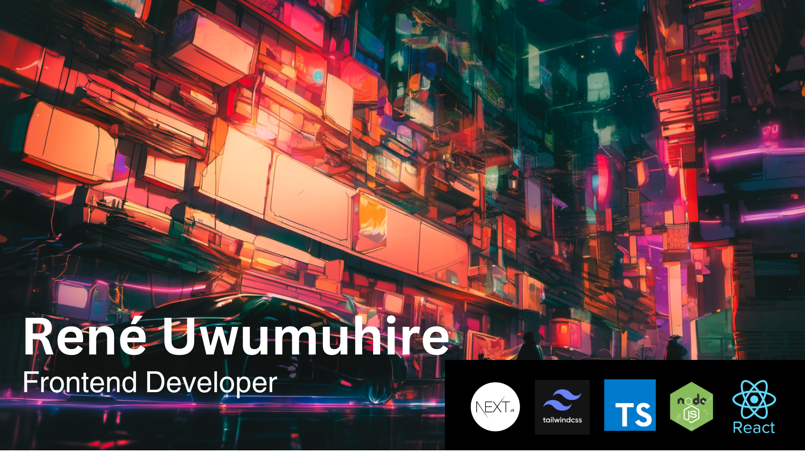

### I am a Software Developer
### I am based in Rwanda
### **reneuwumuhire@gmail.com** 
### Tel: **+250788804581** 
### [LinkedIn](https://www.linkedin.com/in/reneuwumuhire/) [GitHub](https://github.com/Reneuwumuhire/) 

### My Skills 

## Connect with me:

<!--
**GlenMac90/GlenMac90** is a ✨ _special_ ✨ repository because its `README.md` (this file) appears on your GitHub profile.

Here are some ideas to get you started:

- 🔭 I’m currently working on ...
- 🌱 I’m currently learning ...
- 👯 I’m looking to collaborate on ...
- 🤔 I’m looking for help with ...
- 💬 Ask me about ...
- 📫 How to reach me: ...
- 😄 Pronouns: ...
- ⚡ Fun fact: ...
-->
